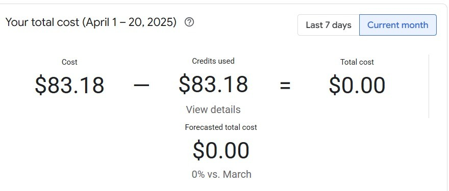
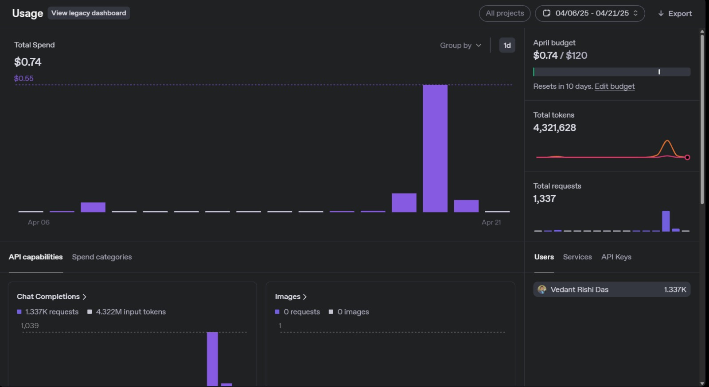

# AI-GovBot: HARVEY

<p align="center">
  
</p>

A chatbot powered by Retrieval-Augmented Generation (RAG) that leverages the AI Governance and Regulatory Archive (AGORA) dataset to help organizations navigate AI-related laws and regulations.

## Overview

H.A.R.V.E.Y (**H**olistic **A**I for **R**egulatory **V**erification and **E**thical **Y**ield) is an intelligent legal assistant that provides accurate information and insights about AI regulations, policies, and compliance requirements. By combining advanced retrieval mechanisms with generative AI, HARVEY delivers contextually relevant responses to legal queries related to artificial intelligence governance.

## Project Architecture


## Accessing Project Components

- [Data Pipeline Documentation](data/data-pipeline/README.md)
- [RAG Pipeline Documentation](src/readme/README_RAG_pipeline.md)
- [Web Application Documentation](src/readme/README_web_app.md)
- [Data Deployment Documentation](deployment_scripts/data-pipeline-deployment/data-pipeline-deploy_readme.md)
- [Model Deployment Documentation](deployment_scripts/model-deployment/model-deploy_readme.md)
## Features

* **Regulatory Search:** Query AI-related laws, policies, and standards using the AGORA dataset as the knowledge base.
* **Intelligent Summarization:** Leverages Large Language Models (LLMs) to retrieve and summarize relevant sections from regulatory texts.
* **Context-Aware Responses:** Provides answers grounded in the retrieved documents from the AGORA dataset using a Retrieval-Augmented Generation (RAG) pipeline.
* **User-Friendly Interface:** Interact with the system via an intuitive chatbot interface built with Streamlit.
* **Multiple LLM Support:** Flexible backend allows integration with various LLMs (e.g., OpenAI, Anthropic Claude, Hugging Face Hub, Ollama).
* **Content Moderation:** Includes checks to moderate user inputs before processing.
## Deployment

HARVEY can be deployed using our automated deployment scripts:

### Model Deployment (GKE)

Deploy the HARVEY application on Google Kubernetes Engine:
- [Model Deployment Instructions](deployment_scripts/model-deployment/model-deploy_readme.md)
- Run `./deployment_scripts/model-deployment/model-deploy.sh` to deploy
- For rollbacks: `./deployment_scripts/model-deployment/rollback.sh`

### Data Pipeline Deployment (Airflow on VM)

Deploy the data processing pipeline on a GCP VM with Airflow:
- [Data Pipeline Deployment Instructions](deployment_scripts/data-pipeline-deployment/data-pipeline-deploy_readme.md)
- Run `./deployment_scripts/data-pipeline-deployment/pr_setup_airflow_vm.sh` to set up the VM

### Deployment Prerequisites

- Google Cloud Platform account with billing enabled
- gcloud CLI installed and configured
- Docker installed for local development and testing
- Kubernetes (kubectl) for interacting with GKE
- API keys for OpenAI/other LLM providers

## Tech Stack

* **Core & Backend:** Python, FastAPI, Uvicorn
* **Data Pipeline:** Apache Airflow, Pandas, TFDV, Docker Compose
* **ML/RAG:** LangChain, Sentence Transformers, FAISS (for retrieval), various LLM clients
* **Frontend:** Streamlit
* **MLOps & Evaluation:** MLflow (tracking), Langfuse (tracing), RAGAs (evaluation), Pytest (testing), DVC (data versioning)
* **Infrastructure:** Docker, Google Cloud Platform (GCP)

## How to Use

1. Clone the repository:
   ```
   git clone https://github.com/ashrane111/AI-GovBot.git
   cd AI-GovBot
   ```

   **Note : Please change the gcs_storage.bucket_name in src/main/config.json and bucket_name in data/data-pipeline/config/config.json to something different since bucket names are unique. Both names should be the same.**

2. Set up dependencies:
   ```
   pip install -r src/requirements.txt
   ```

3. Configure the AGORA dataset following the [data pipeline documentation](data/data-pipeline/README.md)

4. Launch the backend
   ```
   python src/backend/services.py
   ```

5. Launch the frontend:
   ```
   streamlit run src/frontend/streamlit.py --server.port 8501
   ```

6. Input your AI-Related legal queries and receive insights instantly!

For production deployment, follow the [deployment instructions](#deployment) above.

## Static Links to Deployments
```
Model Deployment - http://35.229.66.170/
 ```
```
Data pipeline - http://34.73.215.163:8080/

username - airflow2

password - airflow2
```
## Cost Analysis
<p align="center">
  
</p>

This project utilizes Google Cloud Platform (GCP) for its infrastructure. The following analysis is based on observed costs from *April 1 - April 20, 2025*:

* **Total GCP Cost Incurred:** \$83.18
* **Primary Cost Drivers:**
    * *Compute Engine:* \$49.25 (Likely associated with VMs running the Airflow data pipeline and potentially other services)
    * *Kubernetes Engine:* \$25.93 (Indicating usage for application hosting or other components)
    * *Networking:* \$6.47
    * Other smaller costs included Cloud Monitoring (\$1.36), VM Manager (\$0.08), Artifact Registry (\$0.07), and Cloud Storage (\$0.02).
* **Credits Applied:** \$83.18
* **Net GCP Cost:** *\$0.00* (For the observed period, all incurred costs were fully offset by GCP credits).

*Note:* This analysis covers GCP infrastructure costs only. Costs associated with external Large Language Model (LLM) API usage (e.g., OpenAI, Anthropic) are separate and not included in these figures.

<p align="center">
  
</p>

This project utilizes APIs like GPT-4o-mini for its LLM Calls. The following analysis is based on observed costs from *April 6 - April 21, 2025*:

* **Total OpenAI Cost Incurred:** \$0.74

Since we are using GPT-4o-mini, the cost is less. The total calls made during this period was 1337.


<p align="center">
  
</p>

