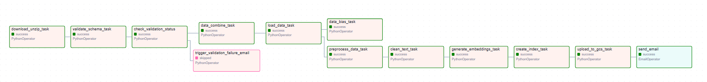

# Data Pipeline Workflow Overview

This document provides a detailed overview of the data pipeline workflow implemented using Apache Airflow. The pipeline is designed to take raw data from external sources through a series of structured processing stages—from data acquisition and validation to data transformation, feature engineering, indexing, and finally uploading to a cloud storage endpoint. Each stage is encapsulated in an Airflow task, ensuring modular, reproducible, and easily maintainable code.

## Data-pipeline Directory Structure

```
│
├── Dockerfile                     # Defines Airflow container with dependencies
├── docker-compose.yaml            # Orchestrates Airflow services
├── requirements.txt               # Python package dependencies
│
├── dags/                          # Airflow DAG definitions
│   ├── airflow.py                 # Main DAG defining the data pipeline workflow
│   │
│   ├── utils/                       # Utility functions for pipeline tasks
│   │   ├── bias_detection.py        # Detects bias in data and provides a report
│   │   ├── create_vector_index.py   # Creates FAISS vector index from embeddings
│   │   ├── data_extract_combine.py  # Extracts and merges document data
│   │   ├── data_loader.py           # Loads and prepares data for processing
│   │   ├── data_schema_generation.py# Generates schema definitions (.pbtxt) for data validation
│   │   ├── data_validation.py       # Validates data against defined schemas
│   │   ├── download_data.py         # Downloads and extracts source data files
│   │   ├── embeddings_gen.py        # Generates text embeddings using transformers
│   │   ├── gcs_upload.py            # Uploads processed data to Google Cloud Storage
│   │   ├── preprocess_data.py       # Preprocesses text data for embedding
|   |   └── text_clean.py            # Cleans and normalizes text content
│   │
│   └── schema/                    # Schema definitions for data validation used in the pipeline
│       ├── authorities_data_schema.pbtxt  # Defines schema for authority-related data
│       ├── collections_data_schema.pbtxt  # Defines schema for collection-related data
│       ├── documents_data_schema.pbtxt    # Defines schema for document-related data
│       ├── documents_segments_merged_data_schema.pbtxt  # Defines schema for merged document segments data
│       ├── segments_data_schema.pbtxt     # Defines schema for segment-related data
│
├── config/                        # Configuration files
│   └── config.json                # Central configuration for pipeline parameters
│
├── merged_input/                  # Storage for downloaded and processed data (during run)
│   └── agora/                     # Directory containing source files 
│
├── faiss_index/                   # Output directory for vector indices
│   └── index.faiss                # Generated vector index file (during run)
│   └── index.pkl                  # Generated vector pickle file (during run)
│
├── bias_analysis/                    # Directory containing bias analysis report
│   └── bias_detection_summary.txt    # Generated bias analysis report during run
│
└── embeddings/                    # Storage for generated embeddings
    └── embeddings.pkl             # Serialized text embeddings (during run)
```

## Workflow Overview

Below is the graphical representation of the pipeline



## Pipeline Stages

### 1. Data Acquisition
- **Task:** `download_unzip_task`
- **Description:**  
  This task initiates the pipeline by downloading a zipped dataset from a specified URL and unzipping it into a designated directory (`merged_input`). It ensures that the data acquisition process is reproducible, and external dependencies (such as network access) are well defined.

### 2. Schema Validation
- **Task:** `validate_schema_task`
- **Description:**  
  Once the data is downloaded, the pipeline validates the integrity and structure of the CSV files. The task pairs each data file (like `authorities.csv`, `collections.csv`, `documents.csv`, and `segments.csv`) with its expected schema (stored in corresponding `.pbtxt` files). This stage is essential to ensure data quality and consistency before any processing occurs.

### 3. Validation Check
- **Task:** `check_validation_task`
- **Description:**  
  This task checks the output from the schema validation process. It identifies any anomalies such as schema mismatches or missing values. The results are then used to determine whether the pipeline should proceed or trigger an alert.

### 4. Anomaly Alert for Validation Failure
- **Task:** `trigger_validation_failure_email`
- **Description:**  
  Should the validation check detect any anomalies, this task sends an automated email alert detailing the issues. This error-handling mechanism helps in prompt identification and resolution of data quality problems.

### 5. Data Integration
- **Task:** `data_combine_task`
- **Description:**  
  After successful validation, this stage merges and combines various documents from the dataset into a single coherent file (e.g., `Documents_segments_merged.csv`). The custom function `extract_and_merge_documents` achieves this by integrating fragmented data sources.

### 6. Data Loading
- **Task:** `load_data_task`
- **Description:**  
  The unified dataset is then loaded into memory. This prepares the data for further preprocessing and ensures that subsequent tasks can access the complete dataset.

### 7. Data Preprocessing
- **Task:** `preprocess_data_task`
- **Description:**  
  This stage involves cleaning and transforming the loaded data. It prepares the dataset by handling missing values, transforming features, and applying any necessary formatting adjustments. The modular design of the preprocessing code allows for easy customization.

### 8. Text Cleaning
- **Task:** `clean_text_task`
- **Description:**  
  Specialized text cleaning is applied to the preprocessed data. The function `clean_full_text` refines the dataset by removing noise, correcting formatting, and standardizing text—an essential step for natural language processing tasks.

### 9. Embeddings Generation
- **Task:** `generate_embeddings_task`
- **Description:**  
  Once the text is cleaned, this task converts the textual data into numerical embeddings using the `generate_embeddings` function. These embeddings capture semantic meaning and are critical for downstream tasks such as similarity searches or feature extraction.

### 10. Index Creation
- *Task:* create_index_task
- *Description:*  
  Using the generated embeddings, the pipeline creates a vector index with the create_index function. This index facilitates efficient retrieval operations and can serve as the basis for similarity matching in applications like search or recommendation systems.

### 11. Upload to Cloud Storage
- *Task:* upload_to_gcs_task
- *Description:*  
  The final processed data or index is uploaded to Google Cloud Storage (GCS) using the upload_merged_data_to_gcs function. This ensures that the outputs are stored securely and are accessible for future use or further processing in a cloud environment.

### 12. Notification of Completion
- *Task:* send_email
- *Description:*  
  At the end of the pipeline, a success notification is sent via email. This automated alert confirms that all tasks have been executed successfully and the pipeline run has been completed.

## Workflow and Task Dependencies

- *Sequential Flow:*  
  The pipeline is structured as a Directed Acyclic Graph (DAG) in Airflow. The process starts with data acquisition and sequentially follows through validation, integration, loading, preprocessing, text cleaning, embedding generation, index creation, and cloud upload. Each task's output is used as the input for the subsequent stage.

- *Conditional Branching:*  
  - If the schema validation fails, an alternate branch triggers an alert (trigger_validation_failure_email), thereby stopping further processing until the data issues are addressed.
  - If validation passes, the pipeline proceeds smoothly through all the subsequent stages.

- *Error Handling and Logging:*  
  Robust error handling is in place to log discrepancies and send alerts. Logging is managed by Airflow’s built-in mechanisms, ensuring traceability and prompt troubleshooting.