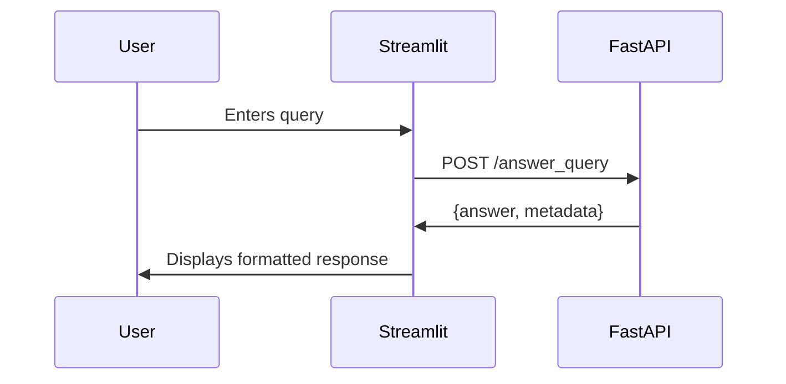

# 🌐 Government AI Assistant Web Application

## Overview  
**H.A.R.V.E.Y Web App** is an interactive interface for querying government policies using AI. Focused exclusively on the web components:

- **FastAPI Backend**: REST API with CORS and async processing
- **Streamlit Frontend**: Stateful chat interface with real-time updates
- **Configuration Management**: JSON-based endpoint configuration
- **Production-Ready**: Port management and service orchestration

## 🖥️ Web-Specific Requirements
- **Core Services**:  
  ```bash
  fastapi 
  uvicorn
  streamlit
  aiohttp
  ```
- **Network**: Localhost ports 8000 (API), 8501 (UI), 5000 (MLflow)

## 🚀 Web App Setup Guide

### 1. Install Dependencies
```bash
pip install -r src/requirements.txt
```

### 2. Backend Initialization
```bash
# Start services (MLflow + FastAPI) from project root
python src/backend/services.py

# Verify endpoints
curl http://localhost:8000/answer_query/healthcheck
```

**Expected Output**:  
```json
{"status":"API operational","timestamp":"2025-03-23T18:52:00"}
```

### 3. Frontend Activation
```bash
# Option 1 - Via wrapper (recommended)
python src/frontend/frontend.py

# Option 2 - Direct Streamlit (might need to provide email)
streamlit run streamlit.py --server.port 8501
```

## 🔄 API-Frontend Integration

### Endpoint Configuration
Modify `frontend_config.json` for different environments:
```json
{
  "CHAT_API": {
    "endpoint": "http://your-production-domain:8000",
    "chat_response_route": "/answer_query"
  }
}
```

### Session Management Flow


## 🛠️ Key Web Components

### Backend Services (`services.py`)
```python
def start_mlflow():
    # Starts MLflow tracking server
    subprocess.Popen(["mlflow", "server", ...])

def start_fastapi():
    # Launches ASGI server
    uvicorn.run(...)
```

### Chat Endpoint (`llm_routes.py`)
```python
@answer_query_router.post("/")
async def answer_query(query_body: MessagesList):
    # Processes 3 types of payloads:
    # 1. New user queries
    # 2. Follow-up questions
    # 3. Contextual requests
```

### Frontend State Management
```python
# Session state initialization
if "messages" not in st.session_state:
    st.session_state.messages = []

# Message processing
async def query_api(messages, api_url):
    # Handles:
    # - Timeouts (10s limit)
    # - JSON serialization
    # - Error recovery
```


## 📂 Web Component Structure
```
web-app/
├── backend/
│   ├── services.py       # Service orchestrator
│   ├── backend.py        # Core API config
│   ├── routes/           # API endpoints
│   └── models/           # Request/response schemas
└── frontend/
    ├── streamlit.py      # Chat UI core
    ├── frontend.py       # UI launcher
    └── frontend_config.json
```

*For RAG pipeline documentation, see RAG_README.md in the main directory.*